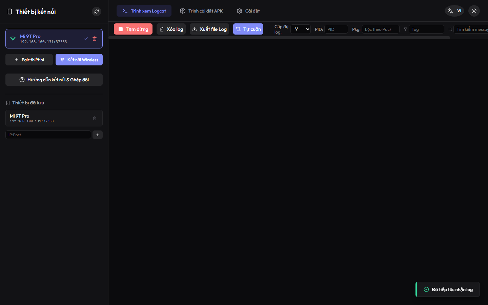
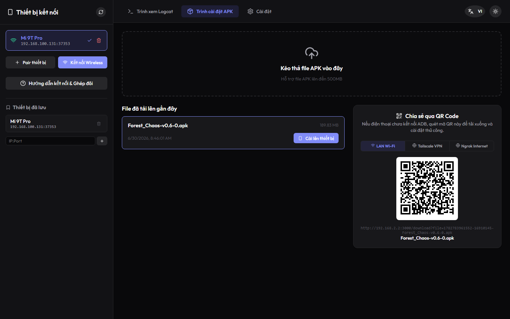
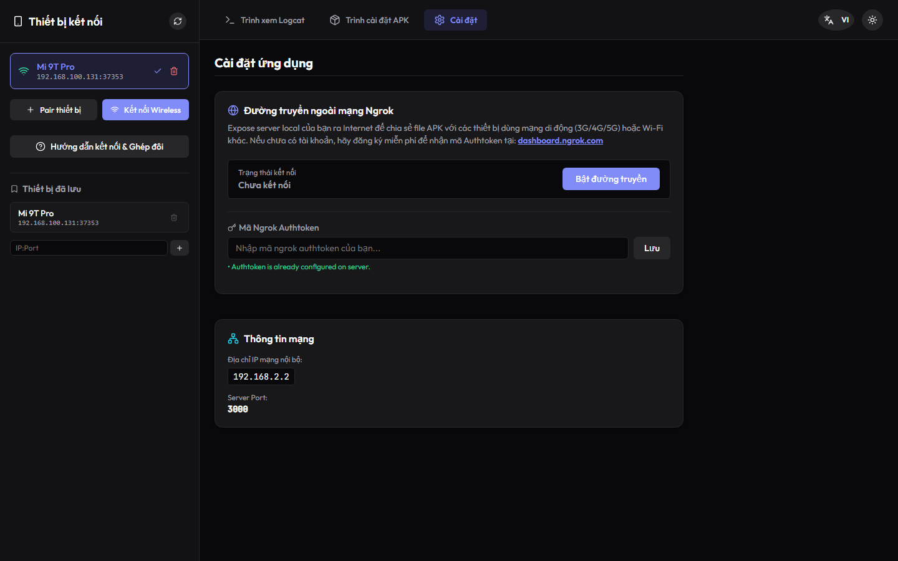

# 📱 APK Install Helper (Android ADB Web Manager)

Công cụ giao diện Web (Web UI) hiện đại giúp quản lý thiết bị Android, cài đặt file APK và theo dõi logcat thời gian thực qua kết nối không dây (Wi-Fi) hoặc có dây thông qua giao thức ADB.

Dự án đã được đóng gói thành file chạy độc lập (`.exe`), người dùng cuối chỉ cần tải về và nhấp đúp để sử dụng ngay mà **không cần cài đặt Node.js, Git hay bất kỳ thư viện nào khác**.

---

## 📸 Ảnh chụp màn hình giao diện

| 📊 Trình theo dõi Logcat (Real-time Logcat Viewer) | 📦 Quản lý và Cài đặt APK (APK Manager) |
| :---: | :---: |
|  |  |

| ⚙️ Cấu hình kết nối & Chia sẻ Tunnel |
| :---: |
|  |

---

## ✨ Các tính năng nổi bật

*   **⚡ Tải & Chạy ngay (Standalone Portable):** Bản đóng gói sẵn `.exe` tự hoạt động độc lập, tự động thiết lập và tải phiên bản Android Platform Tools (ADB) mới nhất từ Google khi chạy lần đầu.
*   **🔗 Kết nối không dây thông minh (Wireless Debugging):**
    *   Hỗ trợ quét thiết bị bằng dịch vụ **Bonjour** (mDNS) để tự động phát hiện thiết bị Android trong mạng LAN.
    *   **Ghép đôi qua mã QR (QR Pairing Mode):** Điện thoại chỉ cần quét mã QR được hiển thị trên trình duyệt để tự động ghép đôi (adb pair) và kết nối (adb connect).
    *   Nhập mã ghép đôi thủ công (Manual Pairing) hoặc kết nối nhanh qua địa chỉ IP & Cổng (Port).
    *   Lưu danh bạ thiết bị (Device Bookmarks) để kết nối lại nhanh chóng ở những lần sau.
*   **📦 Cài đặt APK siêu tốc:**
    *   Hỗ trợ kéo và thả file APK (Drag & Drop) trực tiếp vào trình duyệt.
    *   Tải lên file APK từ máy tính hoặc cài đặt qua đường link liên kết (Install via URL).
    *   Hiển thị tiến trình tải lên và tiến trình cài đặt thời gian thực qua giao tiếp WebSockets.
*   **📊 Trình theo dõi Logcat chuyên nghiệp (Logcat Viewer):**
    *   Hiển thị log thời gian thực của thiết bị đang kết nối.
    *   Bộ lọc log mạnh mẽ: theo Tag, theo từ khóa Tìm kiếm, hoặc theo cấp độ lỗi (Verbose, Debug, Info, Warn, Error, Fatal).
    *   Tính năng tự động cuộn (Auto-scroll) thông minh, tạm dừng/tiếp tục nhận log (Pause/Resume), xóa log (Clear).
    *   Cho phép xuất/tải xuống toàn bộ logcat hiện tại dưới dạng file `.txt`.
*   **🌐 Chia sẻ kết nối diện rộng (Remote Access):**
    *   Tích hợp sẵn công nghệ tạo đường hầm **ngrok Tunnel** để chia sẻ giao diện web lên Internet.
    *   Tự động nhận diện mạng ảo riêng tư **Tailscale IP** và hiển thị QR Code để các thiết bị khác trong cùng mạng VPN quét và truy cập nhanh chóng.
*   **🌓 Giao diện hiện đại & Đa ngôn ngữ:** Giao diện tối ưu hóa trải nghiệm người dùng (UX/UI), hỗ trợ Light/Dark Mode và hai ngôn ngữ: Tiếng Việt và Tiếng Anh.

---

## 🚀 Cách sử dụng bản đóng gói sẵn (Khuyên dùng cho người dùng cuối)

Không cần cài đặt Node.js hay bất kỳ môi trường lập trình nào.

1.  Truy cập thư mục `dist/` trong dự án.
2.  Nhấp đúp chuột vào file **`apk-install-helper.exe`** để khởi chạy.
3.  **Hệ thống tự động thực hiện:**
    *   Tự động kiểm tra và tải về phiên bản ADB mới nhất từ máy chủ Google (nếu thiếu).
    *   Tự động tạo các thư mục lưu trữ cần thiết (`uploads/` để nhận file APK, `bookmarks.json` để lưu danh sách thiết bị).
    *   Tự khởi chạy máy chủ dịch vụ và tự động mở trình duyệt web mặc định của bạn trỏ tới: [http://localhost:3000](http://localhost:3000) để sử dụng ngay lập tức.

> 💡 *Mẹo:* Bạn có thể copy duy nhất file `apk-install-helper.exe` này quẳng sang máy tính chạy Windows khác và chạy bình thường, nó sẽ tự sinh các thư mục đi kèm.

---

## 💻 Hướng dẫn chạy thủ công & Phát triển (Dành cho Lập trình viên)

Nếu bạn muốn chỉnh sửa mã nguồn hoặc khởi chạy thủ công, hãy thực hiện các bước sau:

### Yêu cầu hệ thống
*   [Node.js](https://nodejs.org/) (Phiên bản v18 trở lên).

### Bước 1: Cài đặt dependencies cho cả Client và Server
```bash
npm run install:all
```
*(Lệnh này sẽ tự động cài đặt các node_modules ở thư mục gốc, client và server).*

### Bước 2: Thiết lập ADB (Chỉ cần chạy một lần)
```bash
node server/scripts/download-adb.js
```
*(Nếu bạn dùng macOS hoặc Linux, bạn cần cài đặt adb thông qua Package Manager của hệ thống, ví dụ `brew install android-platform-tools` hoặc `sudo apt install adb` và cấu hình đường dẫn ADB).*

### Bước 3: Khởi chạy môi trường phát triển (Development)
```bash
npm run dev
```
*   Server API chạy ở cổng `3000`.
*   Client Vite chạy ở cổng `5173`. Giao diện dev tự động mở tại `http://localhost:5173` và tự động kết nối proxy về cổng server `3000`.

### Bước 4: Tự đóng gói file chạy `.exe` (Build Standalone Executable)
Nếu bạn thay đổi code và muốn đóng gói lại file chạy:
1.  **Build client React:**
    ```bash
    npm run build --workspace=client
    ```
2.  **Copy build client sang thư mục public của server:**
    ```bash
    Copy-Item -Path "client/dist/*" -Destination "server/src/public" -Recurse -Force
    ```
3.  **Đóng gói server thành file thực thi:**
    ```bash
    npm run build:exe --workspace=server
    ```
    *File thực thi mới sẽ được tạo ra tại thư mục `dist/apk-install-helper.exe`.*

---

## 📱 Hướng dẫn cấu hình trên điện thoại Android

Để kết nối không dây, điện thoại Android của bạn cần được cấu hình như sau:

1.  **Bật Tùy chọn nhà phát triển (Developer Options):**
    *   Vào `Cài đặt` -> `Thông tin điện thoại` -> Chạm liên tục 7 lần vào `Số hiệu bản dựng` (Build Number) cho đến khi xuất hiện thông báo bạn đã là nhà phát triển.
2.  **Kích hoạt Gỡ lỗi không dây (Wireless Debugging):**
    *   Vào `Cài đặt` -> `Hệ thống` -> `Tùy chọn nhà phát triển`.
    *   Bật **Gỡ lỗi qua USB (USB Debugging)** và **Gỡ lỗi không dây (Wireless Debugging)**.
    *   *Lưu ý:* Điện thoại và máy tính chạy ứng dụng phải kết nối chung một mạng Wi-Fi.
3.  **Cách ghép đôi & Kết nối:**
    *   **Cách 1 (Quét QR - Khuyên dùng):** Trong mục *Gỡ lỗi không dây*, chọn *Ghép nối thiết bị bằng mã QR*. Trên giao diện Web của máy tính, mở bảng Ghép nối (Pair Device), chọn *Quét QR*, đưa camera điện thoại lên quét mã hiển thị trên màn hình. Thiết bị sẽ tự động ghép đôi và kết nối.
    *   **Cách 2 (Mã ghép nối thủ công):** Chọn *Ghép nối thiết bị bằng mã ghép nối*. Nhập địa chỉ IP, Cổng và Mã ghép nối (Pairing code) hiển thị trên điện thoại vào form nhập trên Web.
    *   **Cách 3 (Kết nối trực tiếp):** Nếu thiết bị đã từng được ghép đôi trước đó, bạn chỉ cần lấy thông tin địa chỉ IP & Cổng kết nối hiển thị bên ngoài màn hình *Gỡ lỗi không dây* và điền vào ô kết nối trực tiếp trên Web.

---

## 🔒 Giấy phép bản quyền (License)

Dự án này được phát hành dưới giấy phép MIT License. Bạn hoàn toàn có quyền sao chép, chỉnh sửa và phân phối lại mã nguồn cho mục đích cá nhân hoặc thương mại.
